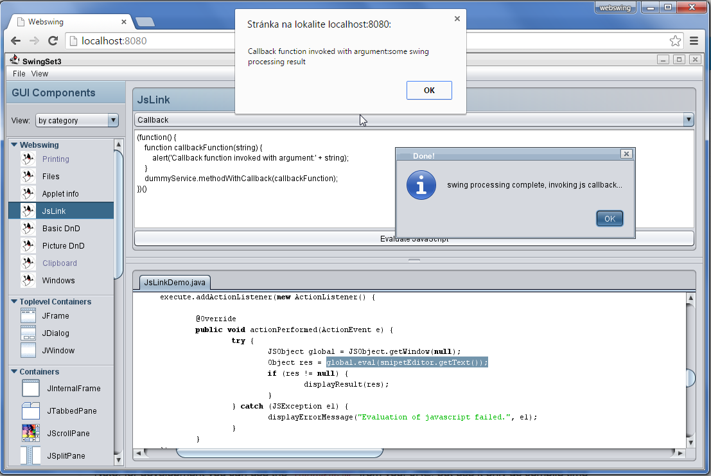

## Overview

Webswing offers javascript integration API, which allows invoking javascript functions from swing application code and vice versa.

Similar functionality is available to Applets and to make the transition to Webswing as easy as possible Webswing supports the same standard API available for Applets [documented here](https://docs.oracle.com/javase/tutorial/deployment/applet/invokingJavaScriptFromApplet.html). In Webswing this API is available to all application.  

You can see this feature in action in the extended SwingSet3 demo application included in Webswing distribution. It demonstrates basic use case scenarios as calling java service from javascirpt or using javascript function callback from java. 



## Eval Javascript from Swing

Lets start with a simple case of evaluating javascript snippet from Swing app.

First, we need to get instance of `netscape.javascript.JSObject` class. We can use the standard static method as documented by Oracle. Only difference is that in Webswing we don't need to pass the Applet instance as the parameter. This way it is available for non-applet swing applications as well. 

>Note: for development you can use the `lib/plugin.jar` from your JRE, but use it only as compile time dependency. Do not include it in your build. 
 
```java
JSObject global = JSObject.getWindow(null);
```

The variable `global` now represents the javascript global object. Now we can evaluate any Javascript on this object. 

```java
Object res = global.eval("return 'Hello world';");
assert res instanceof String && assert res.equals("Hello world");
```

This is the simplest possible example of invoking javascript from Webswing. 
So lets see what happens under the hoods. The `eval` method will send a message to browser through websocket channel and current thread goes to sleep until the evaluation response message is received. 
If the evaluation fails or is not received in 3 seconds `netscape.javascript.JSException` is thrown. 

>Note: Evaluation timeout is set to 3 seconds by default. It can be changed by setting `webswing.syncCallTimeout` system property (in miliseconds).

**Javascript Return Type Mapping**

Javascript  type | Java Type
-----------------|-------------
null or undefined| null
number           | java.lang.Number
string           | java.lang.String
boolean          | java.lang.Boolean
JavaObjectRef*   | refered Java object
other            | netscape.javascript.JSObject

*JavaObjectRef is javascript object created by this API when Java object is passed to javascript using `setMember`, `setSlot` or `call` methods.

>Tip: When returning data from eval. Serialize them to json rather then sending a javascript object directly. Querying the content using `JSObject` interface is costly as each method call requires a server roundtrip.

**JSObject methods**

Method name | Description
------------| -----------
eval        | Evaluates the javascritp in argument and returns result.
call        | calls a function on object represented by this JSObject.
setMember   | creates or sets property on object represented by this JSObject with value from agument.
getMember   | returns property from object represented by this JSObject.
removeMember| deletes property from object represented by this JSObject.
setSlot     | sets value of array represented by this JSObject on specified index.
getSlot     | returns the value from array represented by this JSObject on specified index.

## Invoking Java from Javascript


## Applet specifics

## Security setting